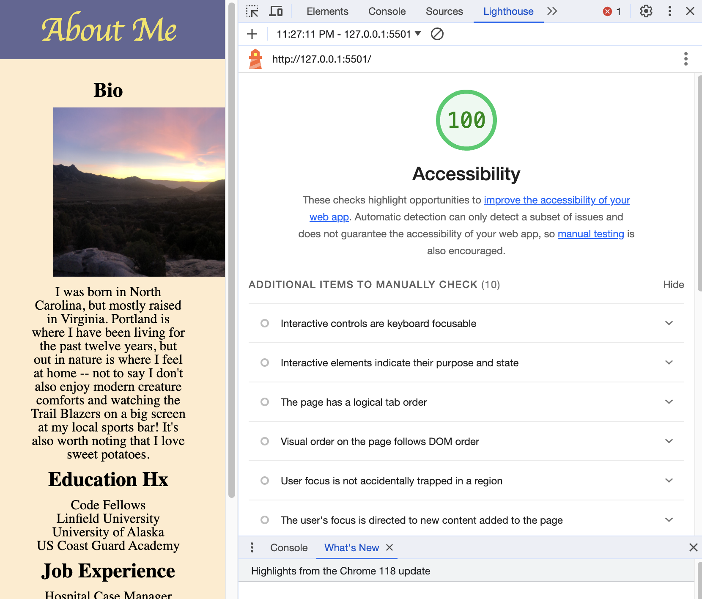

# LAB - 03

## Project About Me

Bare bones website about me. This website should become more aesthetically pleasing, user-friendly, and interactive as I learn new developer skills.
On 10/25 added an image and some lists. Created more user prompts.

### Author: Johnny Backus

### Links and Resources

* [submission PR](http://xyz.com)
* Any Links you used as reference

### Lighthouse Accessibility Report Score

### Reflections and Comments

It ain't easy. I'm keen to keep learning tricks to get faster at some of the more tedious stuff to save time. Used the option + up/down arrow key shortcut today to move lines of code around a couple times.

For our paired programming lab, Anthony was the driver and Johnny was the navigator.
